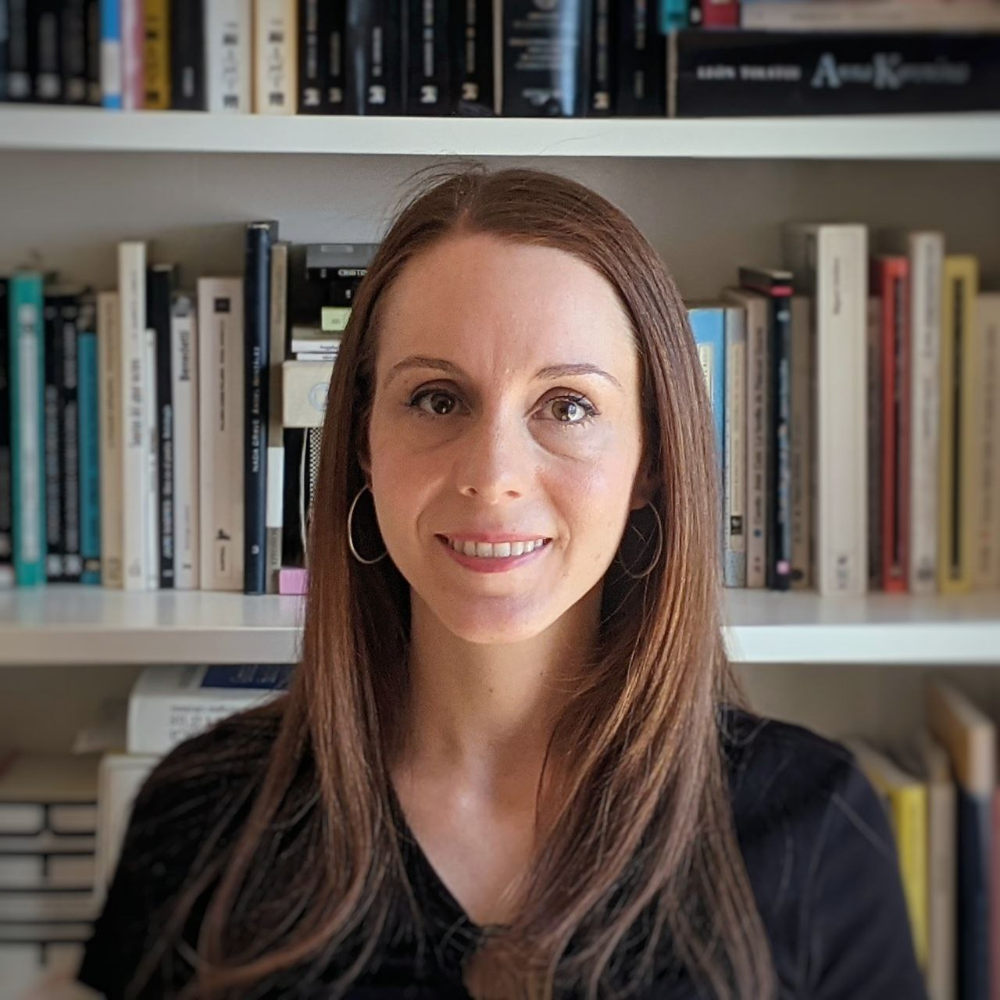

Sonia de Luis Rosell. Me gradué en Filología Hispánica en la Universidad de Barcelona en el 2011 con premio extraordinario de grado y en el 2012 cursé en la misma universidad el Máster de Léxico y Comunicación Lingüística, en el que obtuve el premio extraordinario de máster. 

En los años siguientes trabajé como becaria de corrección y traducción en los Servicios Lingüísticos de la Universidad de Barcelona. Estudié varios cursos de corrección y el Posgrado de Asesoramiento Lingüístico (en catalán) y Servicios Editoriales. 

Scribere (Sonia de Luis-Servicios Lingüísticos) se puso en marcha en el 2014 como espacio para ofrecer [servicios lingüísticos y editoriales](servicios-linguisticos). Desde entonces he trabajado como correctora, traductora y asesora lingüística en catalán y castellano como autónoma para distintas empresas y editoriales, y desde el 2019 trabajo en plantilla en Linguaserve para el Ayuntamiento de Barcelona.

En los últimos años he estudiado el Máster de Comunicación Corporativa, Protocolo y Eventos en la Universidad Abierta de Cataluña, que me permitió iniciar una [investigación](investigacion) sobre comunicación política desde un punto de vista feminista, que continué en el Programa de Doctorado en Comunicación de la Universidad Pompeu Fabra.

He escrito poemarios (*No pasa nada*, *Todo pasa*, *Poemas en ruso* y *El cuerpo*, inéditos), tengo algunas novelas iniciadas y comparto y reseño los libros que me gustan en [@noterminesloslibros](no-termines-los-libros/).

Contacto: [soniadeluisrosell@gmail.com](mailto:soniadeluisrosell@gmail.com)
